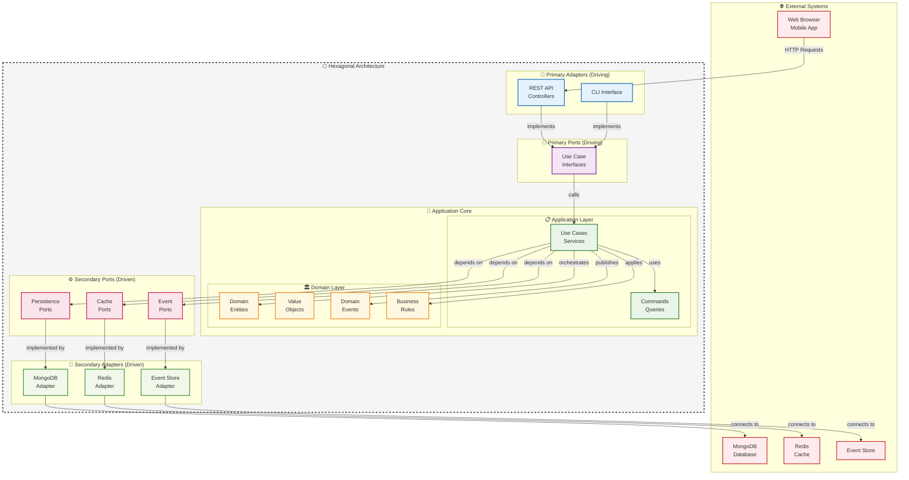
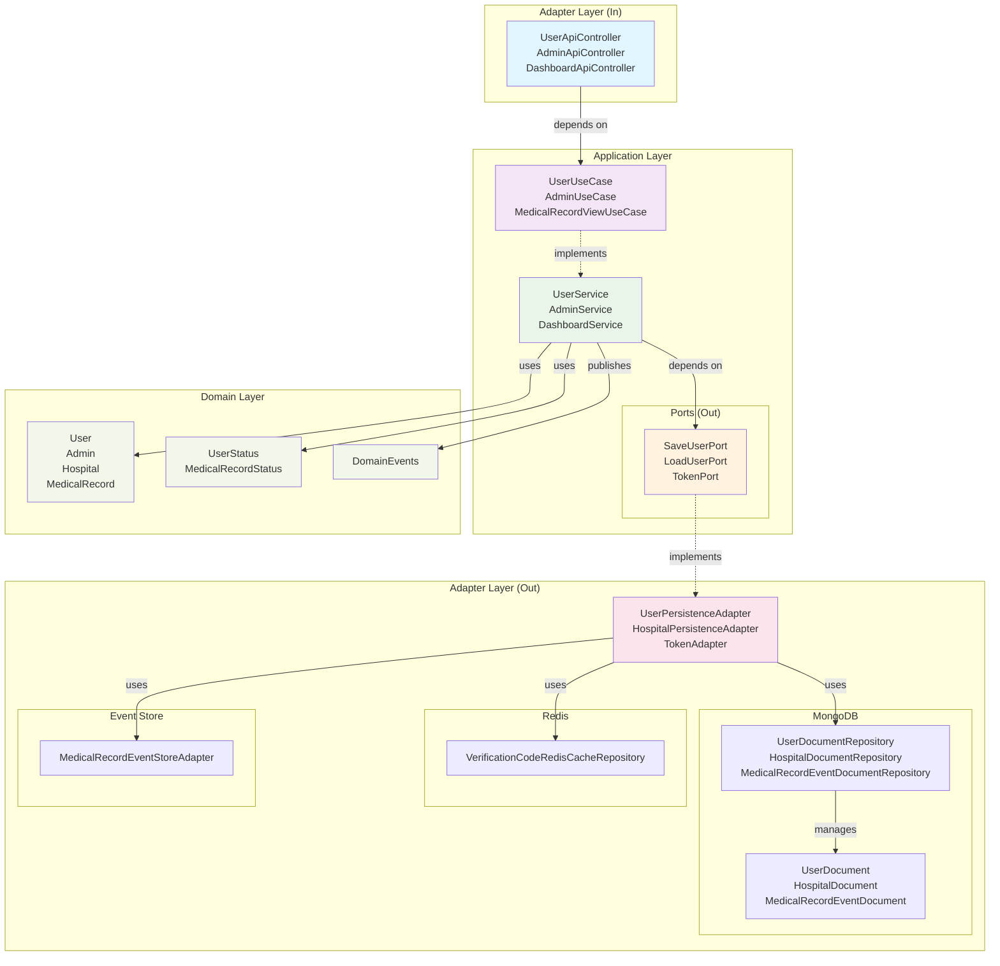

## 개요

MedOps는 **이벤트 소싱(Event Sourcing)** 개념을 구현한 의료 CRM 시스템입니다. 헥사고날 아키텍처(Hexagonal Architecture)를 기반으로 하며, 병원 예약 관리, 환자 관리, 의료진 대시보드 등의 기능을 제공합니다.

### 주요 특징

-  **의료 전문 CRM**: 병원 예약, 환자 관리, 의료진 스케줄링
-  **헥사고날 아키텍처**: 도메인 중심의 클린 아키텍처
-  **이벤트 소싱**: 의료 기록의 모든 변경사항을 이벤트로 추적
-  **실시간 대시보드**: 예약 현황, 매출 통계, 성과 분석
-  **JWT 인증**: 사용자/관리자 역할 기반 접근 제어

## 기술 스택

### 백엔드 (Spring Boot)
- **Java 17** + **Spring Boot 3.5.3**
- **Spring Security** + **JWT** (jjwt 0.12.6)
- **MongoDB** - 메인 데이터 저장소
- **Redis** - 캐싱 및 세션 관리
- **SpringDoc OpenAPI** - API 문서화
- **JaCoCo** - 코드 커버리지 (80% 이상)

### 프론트엔드 (React + TypeScript)
- **React 19.1.1** + **TypeScript 5.8.3**
- **Vite 7.1.2** - 빌드 도구
- **Tailwind CSS 4.1.12** - 스타일링
- **Radix UI** - UI 컴포넌트
- **React Router 7.8.1** - 라우팅
- **ECharts** + **Recharts** - 데이터 시각화

## 🏗️ 아키텍처

### 헥사고날 아키텍처 (Ports and Adapters)



**헥사고날 아키텍처 핵심 개념:**

 **Primary Side (Driving)** - 애플리케이션을 호출하는 쪽:
- **Primary Adapters**: REST API, CLI 등 외부에서 애플리케이션을 호출
- **Primary Ports**: Use Case 인터페이스로 애플리케이션 진입점 정의

 **Secondary Side (Driven)** - 애플리케이션이 호출하는 쪽:
- **Secondary Ports**: 애플리케이션이 외부 시스템에 의존하는 인터페이스
- **Secondary Adapters**: 실제 외부 시스템(DB, Cache 등)과의 연결 구현

 **의존성 방향**: 모든 의존성이 중심(Domain)을 향해 흐름
- Adapter → Port → Application → Domain
- 외부 변경사항이 내부 비즈니스 로직에 영향을 주지 않음

### 백엔드 디렉토리 구조

```
src/main/java/com/medops/
├── adapter/                     # 어댑터 레이어 (외부 시스템 연동)
│   ├── in/                      # 인바운드 어댑터 (외부에서 도메인으로)
│   │   ├── annotation/          # 커스텀 어노테이션 (@UserSession, @AdminSession)
│   │   ├── security/            # Spring Security 설정
│   │   └── web/                 # REST API 컨트롤러
│   │       ├── controller/      # REST 엔드포인트 (User, Admin, Dashboard API)
│   │       ├── exception/       # 글로벌 예외 처리
│   │       ├── request/         # 요청 DTO 클래스
│   │       └── resolver/        # 커스텀 파라미터 리졸버
│   └── out/                     # 아웃바운드 어댑터 (도메인에서 외부로)
│       ├── event/               # 이벤트 리스너
│       ├── persistence/         # 영속성 구현체
│       │   ├── eventstore/      # 이벤트 스토어 어댑터
│       │   ├── mongodb/         # MongoDB 어댑터
│       │   │   ├── adapter/     # 영속성 포트 구현체
│       │   │   ├── converter/   # 도메인 ↔ 문서 변환기
│       │   │   ├── document/    # MongoDB 문서 모델
│       │   │   └── repository/  # Spring Data MongoDB 저장소
│       │   └── redis/           # Redis 캐시 어댑터
│       └── security/            # JWT 토큰 어댑터
│
├── application/                 # 애플리케이션 레이어 (유스케이스)
│   ├── dto/                     # 애플리케이션 데이터 전송 객체
│   ├── eventsourcing/           # 이벤트 소싱 구현
│   │   ├── command/             # 커맨드 객체 및 실행기
│   │   ├── event/               # 도메인 이벤트 정의
│   │   ├── handler/             # 이벤트 핸들러
│   │   └── processor/           # 커맨드 프로세서
│   ├── port/                    # 포트 인터페이스
│   │   ├── in/                  # 인바운드 포트 (유스케이스)
│   │   │   ├── command/         # 커맨드 DTO
│   │   │   └── usecase/         # 유스케이스 인터페이스
│   │   └── out/                 # 아웃바운드 포트 (SPI)
│   └── service/                 # 유스케이스 구현체 (서비스)
│
├── domain/                      # 도메인 레이어 (비즈니스 로직)
│   ├── enums/                   # 도메인 열거형 (상태, 타입 등)
│   ├── event/                   # 도메인 이벤트
│   └── model/                   # 도메인 엔티티 (User, Hospital, MedicalRecord)
│
├── common/                      # 공통 유틸리티
│   ├── error/                   # 에러 코드 정의
│   ├── exception/               # 커스텀 예외
│   └── response/                # 공통 응답 포맷
│
└── config/                      # 설정 클래스 (Spring Configuration)
```

### 레이어 간 통신 관계



**주요 의존성 흐름:**
1. **Controller → UseCase**: REST API 컨트롤러가 유스케이스 인터페이스에 의존
2. **UseCase ← Service**: 서비스가 유스케이스 인터페이스를 구현
3. **Service → OutPort**: 서비스가 아웃바운드 포트 인터페이스에 의존
4. **OutPort ← Adapter**: 어댑터가 아웃바운드 포트를 구현
5. **Service ↔ Domain**: 서비스가 도메인 엔티티와 이벤트 사용

**헥사고날 아키텍처 원칙:**
- **의존성 역전**: 외부 레이어가 내부 레이어에 의존 (Domain ← Application ← Adapter)
- **포트와 어댑터**: 인터페이스(포트)를 통한 느슨한 결합
- **도메인 격리**: 도메인 레이어는 외부 의존성이 없음

### 이벤트 소싱 구현

의료 기록 관리에 이벤트 소싱 패턴을 적용하여 모든 변경사항을 추적합니다:

- **Event Store**: 모든 의료 기록 변경을 이벤트로 저장
- **Snapshots**: 성능 최적화를 위한 스냅샷 생성
- **Event Replay**: 이벤트 재생을 통한 상태 복원
- **Audit Trail**: 완전한 감사 추적 기능

```java
// 이벤트 문서 구조
@Document("medops_medical_record_events")
public class MedicalRecordEventDocument {
    private String recordId;
    private String eventType;
    private Instant createdAt;
    private MedicalRecordStatus status;
    private Map<String, Object> payload;
    private Integer version;
}
```

## 시작하기

### 사전 요구사항

- **Java 17+**
- **Node.js 18+**
- **MongoDB** (로컬 또는 클라우드)
- **Redis** (로컬 또는 클라우드)

### 환경 변수 설정

루트 디렉토리에 `.env.local` 파일 생성:

```bash
# Database
MONGODB_URI=mongodb://localhost:27017/medops
REDIS_HOST=localhost
REDIS_PORT=6379
REDIS_PASSWORD=

# JWT
JWT_SECRET=your-secret-key-here
JWT_EXPIRATION_HOURS=24

# Frontend
FRONTEND_URL=http://localhost:5173
```

### 백엔드 실행

```bash
# 프로젝트 루트에서
./gradlew bootRun

# 또는 개발 프로필로
SPRING_PROFILES_ACTIVE=dev ./gradlew bootRun
```

### 프론트엔드 실행

```bash
cd frontend
npm install
npm run dev
```

##  API 문서

서버 실행 후 다음 URL에서 API 문서를 확인할 수 있습니다:
- **Swagger UI**: http://localhost:8080/swagger-ui.html
- **OpenAPI JSON**: http://localhost:8080/v3/api-docs

##  테스트

### 백엔드 테스트

```bash
# 전체 테스트 실행
./gradlew test

# 코드 커버리지 리포트 생성
./gradlew jacocoTestReport

# 커버리지 확인 (80% 이상 필수)
./gradlew jacocoTestCoverageVerification
```

### 프론트엔드 테스트

```bash
cd frontend

# 타입 체크
npm run build:check

# 린트 검사
npm run lint

# 코드 포맷팅
npm run format
```

##  모니터링 및 성능

### 코드 품질
- **JaCoCo**: 80% 이상 코드 커버리지 유지
- **E2E 테스트**: 실제 데이터베이스를 사용한 통합 테스트
- **ESLint + Prettier**: 일관된 코드 스타일

### 데이터베이스 성능
- **MongoDB**: 인덱스 최적화된 쿼리
- **Redis**: 세션 및 캐시 성능 최적화
- **이벤트 스토어**: 배치 처리 및 스냅샷 전략

##  보안

- **JWT 토큰**: stateless 인증 시스템
- **역할 기반 접근 제어**: 사용자/관리자 권한 분리
- **CORS 설정**: 프론트엔드 도메인 제한
- **입력 검증**: Bean Validation을 통한 데이터 검증

##  배포

### Docker 컨테이너

```bash
# Docker 이미지 빌드
docker build -t medops .

# Docker Compose 실행 (MongoDB, Redis 포함)
docker-compose up -d
```

### 프로덕션 환경

```bash
# 백엔드 빌드
./gradlew build -x test

# 프론트엔드 빌드
cd frontend && npm run build
```

##  TODO - 개선 사항


### ⚡ 성능 최적화
- [ ] **데이터베이스 최적화**: 
  - MongoDB 인덱스 전략 개선
  - 쿼리 성능 모니터링
  - 커넥션 풀 튜닝
- [ ] **캐싱 전략**: 
  - Redis 캐시 정책 세분화
  - CDN 도입 검토
  - 브라우저 캐싱 최적화
- [ ] **이벤트 소싱 최적화**:
  - 스냅샷 생성 주기 조정
  - 이벤트 스토어 파티셔닝
  - 배치 이벤트 처리

###  보안 강화
- [ ] **OAuth 2.0**: 소셜 로그인 (구글, 카카오) 연동
- [ ] **2FA 인증**: 관리자 계정 이중 인증
- [ ] **API Rate Limiting**: DDoS 방어를 위한 요청 제한
- [ ] **보안 헤더**: OWASP 보안 가이드라인 적용
- [ ] **취약점 스캐닝**: 정기적인 보안 감사

###  모니터링 및 운영
- [ ] **APM 도구**: New Relic, DataDog 등 성능 모니터링
- [ ] **로그 수집**: ELK Stack (Elasticsearch, Logstash, Kibana)
- [ ] **메트릭 수집**: Prometheus + Grafana 대시보드
- [ ] **헬스 체크**: 서비스 상태 모니터링
- [ ] **알람 시스템**: 장애 감지 및 알림 자동화

###  품질 향상
- [ ] **테스트 커버리지**: 90% 이상 목표
- [ ] **E2E 테스트**: Cypress 또는 Playwright 도입
- [ ] **성능 테스트**: JMeter를 통한 부하 테스트
- [ ] **코드 품질**: SonarQube 정적 분석 도구
- [ ] **자동화된 배포**: CI/CD 파이프라인 구축

### ️ 아키텍처 개선
- [ ] **마이크로서비스**: 도메인별 서비스 분리 검토
- [ ] **CQRS 패턴**: Command와 Query 분리 고도화
- [ ] **이벤트 버스**: Apache Kafka 도입 검토
- [ ] **서비스 메시**: Istio 또는 Linkerd 도입
- [ ] **컨테이너 오케스트레이션**: Kubernetes 배포
