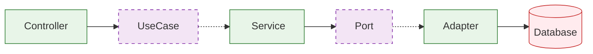
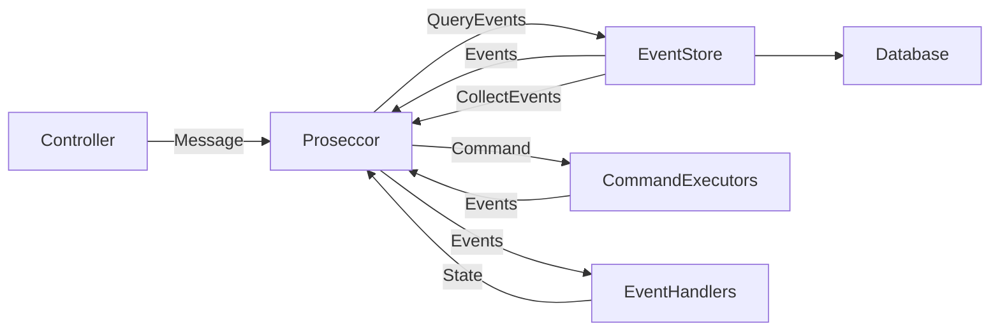

## 개요

MedOps는 **이벤트 소싱(Event Sourcing)** 개념을 구현한 의료 CRM 시스템입니다. 헥사고날 아키텍처(Hexagonal Architecture)를 기반으로 하며, 병원 예약 관리, 환자 관리, 의료진 대시보드 등의 기능을 제공합니다.

### 주요 특징

이 시스템은 **헥사고날 아키텍처**를 기반으로 도메인 중심의 클린한 설계를 구현했습니다. 의료 기록의 모든 변경사항을 **이벤트 소싱**으로 추적하여 완전한 감사 추적이 가능하며, 병원 예약부터 환자 관리, 의료진 스케줄링까지 포괄적인 데이터 관리 기능을 제공합니다. 

실시간으로 업데이트되는 대시보드를 통해 예약 현황, 매출 통계, 성과 분석을 한눈에 확인할 수 있으며, 
SSE를 활용한 실시간 알림으로 예약 변경사항을 즉시 전달받을 수 있습니다. JWT 기반 인증으로 사용자와 관리자의 역할을 명확히 구분하여 보안성을 확보했습니다. 

demo : https://medops.vercel.app/
 
---
## 기술 스택

### 백엔드 (Spring Boot)
- **Java 17** + **Spring Boot 3.5.3**
- **Spring Security** + **JWT** (jjwt 0.12.6)
- **MongoDB** - 메인 데이터 저장소
- **Redis** - 캐싱 및 세션 관리
- **SSE** - 실시간 알림 및 병원별 연결 관리
- **SpringDoc OpenAPI** - API 문서화
- **JaCoCo** - 코드 커버리지 (80% 이상)

### 프론트엔드 (React + TypeScript)
- **React 19.1.1** + **TypeScript 5.8.3**
- **Vite 7.1.2** - 빌드 도구
- **Tailwind CSS 4.1.12** - 스타일링
- **Radix UI** - UI 컴포넌트
- **React Router 7.8.1** - 라우팅
- **ECharts** + **Recharts** - 데이아키텍처

### 백엔드 디렉토리 구조 (헥사고날 아키텍처)

```
src/main/java/com/medops/
├── adapter/                     # 어댑터 레이어 (외부 시스템 연동)
│   ├── in/                      # 인바운드 어댑터 (외부에서 도메인으로)
│   │   ├── annotation/          # 커스텀 어노테이션 (@UserSession, @AdminSession)
│   │   ├── security/            # Spring Security 설정
│   │   └── web/                 # REST API 컨트롤러
│   │       ├── controller/      # REST 엔드포인트 (User, Admin, Dashboard API)
│   │       ├── exception/       # 글로벌 예외 처리
│   │       ├── request/         # 요청 DTO 클래스
│   │       └── resolver/        # 커스텀 파라미터 리졸버
│   └── out/                     # 아웃바운드 어댑터 (도메인에서 외부로)
│       ├── event/               # 이벤트 리스너
│       ├── persistence/         # 영속성 구현체
│       │   ├── eventstore/      # 이벤트 스토어 어댑터
│       │   ├── mongodb/         # MongoDB 어댑터
│       │   │   ├── adapter/     # 영속성 포트 구현체
│       │   │   ├── converter/   # 도메인 ↔ 문서 변환기
│       │   │   ├── document/    # MongoDB 문서 모델
│       │   │   └── repository/  # Spring Data MongoDB 저장소
│       │   └── redis/           # Redis 캐시 어댑터
│       └── security/            # JWT 토큰 어댑터
│
├── application/                 # 애플리케이션 레이어 (유스케이스)
│   ├── dto/                     # 애플리케이션 데이터 전송 객체
│   ├── eventsourcing/           # 이벤트 소싱 구현
│   │   ├── command/             # 커맨드 객체 및 실행기
│   │   ├── event/               # 도메인 이벤트 정의
│   │   ├── handler/             # 이벤트 핸들러
│   │   └── processor/           # 커맨드 프로세서
│   ├── port/                    # 포트 인터페이스
│   │   ├── in/                  # 인바운드 포트 (유스케이스)
│   │   │   ├── command/         # 커맨드 DTO
│   │   │   └── usecase/         # 유스케이스 인터페이스
│   │   └── out/                 # 아웃바운드 포트 (SPI)
│   └── service/                 # 유스케이스 구현체 (서비스)
│
├── domain/                      # 도메인 레이어 (비즈니스 로직)
│   ├── enums/                   # 도메인 열거형 (상태, 타입 등)
│   ├── event/                   # 도메인 이벤트
│   └── model/                   # 도메인 엔티티 (User, Hospital, MedicalRecord)
│
├── common/                      # 공통 유틸리티
│   ├── error/                   # 에러 코드 정의
│   ├── exception/               # 커스텀 예외
│   └── response/                # 공통 응답 포맷
│
└── config/                      # 설정 클래스 (Spring Configuration)
```

### 레이어 간 통신 관계



애플리케이션의 데이터는 다음과 같이 흐릅니다:
`웹 요청` → `컨트롤러` → `유스케이스` → `서비스` → `포트` → `어댑터` → `데이터베이스`

하지만 의존성 방향은 반대입니다:
- `컨트롤러`는 `유스케이스 인터페이스`에 의존
- `서비스`가 `유스케이스 인터페이스`를 구현
- `서비스`는 `포트 인터페이스`에 의존  
- `어댑터`가 `포트 인터페이스`를 구현

이를 통해 외부 시스템(데이터베이스, API 등)이 변경되어도 핵심 비즈니스 로직은 영향받지 않습니다.

### 이벤트 소싱 구현

의료 기록 관리에 이벤트 소싱 패턴을 적용하여 모든 변경사항을 추적합니다:



#### 1️⃣ 새로운 예약 생성
```
환자가 병원 예약을 생성하는 경우:
Controller → Processor → CommandExecutor → EventStore

• CreateMedicalRecordCommand 전달
• CommandExecutor가 MedicalRecordCreatedEvent 생성
• EventStore에 이벤트 저장 (version: 1)
• EventHandler가 스냅샷 생성
```

#### 2️⃣ 예약 상태 변경 (확정)
```
의사가 예약을 확정하는 경우:
Controller → Processor → [스냅샷 조회] → EventHandler → CommandExecutor → EventStore

• ConfirmMedicalRecordCommand 전달
• 기존 스냅샷에서 현재 상태 조회 (PENDING)
• EventHandler가 최신 상태로 복원
• StatusChangedEvent 생성 (PENDING → CONFIRMED)
• EventStore에 저장 (version: 2)
```

#### 3️⃣ 예약 취소 및 상태 복원
```
환자가 예약을 취소하고, 관리자가 과거 상태를 조회하는 경우:
Controller → Processor → EventStore [Query Events] → EventHandler

• CancelMedicalRecordCommand 실행 → StatusChangedEvent (version: 3)
• 과거 시점 조회 요청시:
  - EventStore에서 특정 version까지의 이벤트만 조회
  - EventHandler가 순차적으로 이벤트 재생
  - 해당 시점의 정확한 상태 복원
```

**이벤트 소싱의 핵심 이점:**

이벤트 소싱을 통해 예약 생성부터 확정, 취소까지의 모든 과정이 이벤트로 기록되어 **완전한 감사 추적**이 가능합니다. "왜 이 예약이 취소되었을까?"와 같은 질문에 대해 이벤트 히스토리를 조회하여 **시간 여행 디버깅**을 할 수 있으며, 스냅샷을 활용한 빠른 현재 상태 조회와 필요시에만 이벤트를 재생하는 방식으로 **성능을 최적화**했습니다. 

또한 시스템 장애나 데이터 손실이 발생하더라도 저장된 모든 이벤트를 순차적으로 재생하여 완전한 상태 복원이 가능하므로 **높은 신뢰성과 복구 능력**을 제공합니다.

---
## 시작하기

### 사전 요구사항

- **Java 17+**
- **Node.js 18+**
- **MongoDB** (로컬 또는 클라우드)
- **Redis** (로컬 또는 클라우드)

### 환경 변수 설정

루트 디렉토리에 `.env.local` 파일 생성:

```bash
# Database
MONGODB_URI=mongodb://localhost:27017/medops
REDIS_HOST=localhost
REDIS_PORT=6379
REDIS_PASSWORD=

# JWT
JWT_SECRET=your-secret-key-here
JWT_EXPIRATION_HOURS=24

# Frontend
FRONTEND_URL=http://localhost:5173
```

### 백엔드 실행

```bash
# 프로젝트 루트에서
 export $(grep -v '^#' .env.local | xargs) && ./gradlew bootRun

# 또는 개발 프로필로
SPRING_PROFILES_ACTIVE=dev ./gradlew bootRun
```

### 프론트엔드 실행

```bash
cd frontend
npm install
npm run dev
```

##  API 문서

서버 실행 후 다음 URL에서 API 문서를 확인할 수 있습니다:
- **Swagger UI**: http://localhost:8080/swagger-ui.html
- **OpenAPI JSON**: http://localhost:8080/v3/api-docs
---
##  테스트

### 백엔드 테스트

```bash
# 전체 테스트 실행
./gradlew test

# 코드 커버리지 리포트 생성
./gradlew jacocoTestReport

# 커버리지 확인 (80% 이상 필수)
./gradlew jacocoTestCoverageVerification
```

### 프론트엔드 테스트

```bash
cd frontend

# 타입 체크
npm run build:check

# 린트 검사
npm run lint

# 코드 포맷팅
npm run format
```
