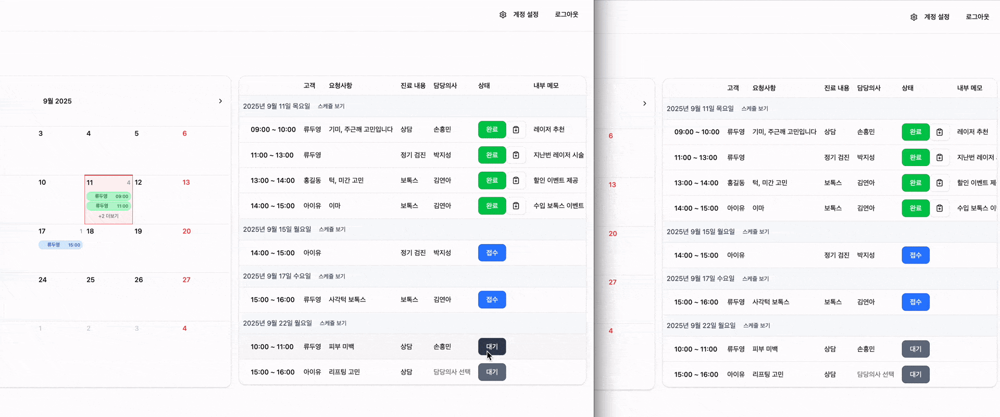
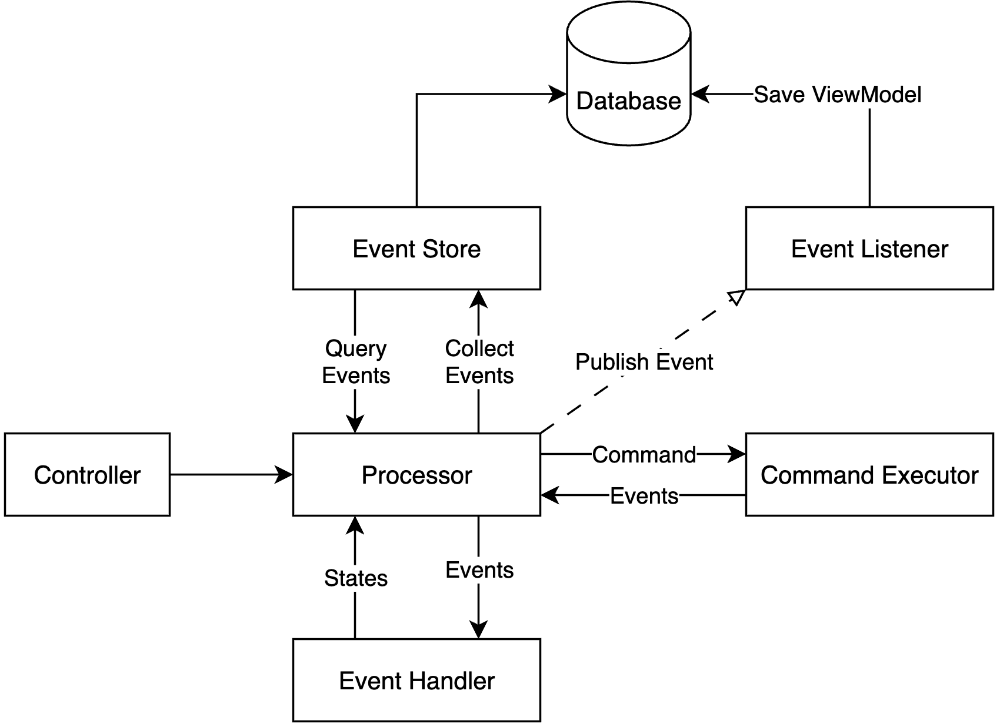

MedOps는 헥사고날 아키텍처를 기반으로 하며, 병원 예약 관리, 환자 관리, 의료진 대시보드 등의 기능을 제공하며
이벤트 소싱 개념과 CQRS 패턴을 기초 수준에서 구현하여 Command(쓰기)와 Query(읽기) 책임을 분리했습니다. 
Command는 도메인 이벤트를 생성하고, 이벤트 핸들러가 읽기 전용 View 모델을 업데이트하는 구조로 설계되어 있습니다.

**Live Demo : https://medops.vercel.app/**

## 주요 특징

이 시스템은 **헥사고날 아키텍처**를 기반으로 도메인 중심의 클린한 설계를 구현했습니다. 의료 기록의 모든 변경사항을 **이벤트 소싱**으로 추적하여 완전한 감사 추적이 가능하며, 병원 예약부터 환자 관리, 의료진 스케줄링까지 포괄적인 데이터 관리 기능을 제공합니다. 

실시간으로 업데이트되는 대시보드를 통해 예약 현황, 매출 통계, 성과 분석을 한눈에 확인할 수 있으며, 
SSE를 활용한 실시간 알림으로 예약 변경사항을 즉시 전달받을 수 있습니다. JWT 기반 인증으로 사용자와 관리자의 역할을 명확히 구분하여 보안성을 확보했습니다.

### 예약 관리 시스템

이 기능의 핵심은 예약의 생성부터 완료까지 모든 상태 변경을 이벤트로 기록하여 데이터의 변경 과정을 완벽하게 추적하는 이벤트 소싱 기반의 상태 관리입니다. 이를 통해 특정 시점의 상태를 정교하게 복원할 수 있는 안정적인 시스템을 구축했습니다.

### 실시간 알림

Spring Boot의 SseEmitter를 활용하여 서버에서 클라이언트로 단방향 데이터 푸시가 가능한 실시간 알림 기능을 구현했습니다. WebSocket에 비해 가볍고 구현이 용이한 장점이 있습니다. 여러 관리자가 별도의 새로고침 없이 최신 예약 현황을 동기화할 수 있어, 다중 사용자 환경에서의 운영 효율성과 데이터 일관성을 크게 향상시켰습니다.

### 관리자 대시보드

관리자 대시보드는 CQRS 패턴을 적용하여 복잡한 조회 요건을 효율적으로 처리하도록 설계했습니다. 쓰기(Command) 모델과 분리된 읽기(Query) 전용 모델을 통해 실시간 예약 현황 및 매출 통계 조회의 성능을 최적화했습니다. 또한, 조회된 통계 데이터는 EChart.js와 연동하여 동적인 차트로 시각화함으로써, 관리자가 비즈니스 현황을 직관적으로 파악하고 데이터 기반의 의사결정을 내릴 수 있도록 지원합니다.


 
---
## 기술 스택

### 백엔드 (Spring Boot)
- Java + Spring Boot + Spring Security
- MongoDB (데이터 저장), Redis (캐싱)
- JWT 인증, SSE 실시간 알림
- OpenAPI 문서화, JaCoCo 테스트 커버리지

### 프론트엔드 (React + TypeScript)
- React + TypeScript + Vite
- Tailwind CSS (스타일링), ECharts (차트)

### 백엔드 디렉토리 구조 (헥사고날 아키텍처)

```
src/main/java/com/medops/
├── adapter/                     # 어댑터 레이어 (외부 시스템 연동)
│   ├── in/                      # 인바운드 어댑터 (외부에서 도메인으로)
│   │   ├── annotation/          # 커스텀 어노테이션 (@UserSession, @AdminSession)
│   │   ├── security/            # Spring Security 설정
│   │   └── web/                 # REST API 컨트롤러
│   │       ├── controller/      # REST 엔드포인트 (User, Admin, Dashboard API)
│   │       ├── exception/       # 글로벌 예외 처리
│   │       ├── request/         # 요청 DTO 클래스
│   │       └── resolver/        # 커스텀 파라미터 리졸버
│   └── out/                     # 아웃바운드 어댑터 (도메인에서 외부로)
│       ├── event/               # 이벤트 리스너
│       ├── persistence/         # 영속성 구현체
│       │   ├── eventstore/      # 이벤트 스토어 어댑터
│       │   ├── mongodb/         # MongoDB 어댑터
│       │   │   ├── adapter/     # 영속성 포트 구현체
│       │   │   ├── converter/   # 도메인 ↔ 문서 변환기
│       │   │   ├── document/    # MongoDB 문서 모델
│       │   │   └── repository/  # Spring Data MongoDB 저장소
│       │   └── redis/           # Redis 캐시 어댑터
│       └── security/            # JWT 토큰 어댑터
│
├── application/                 # 애플리케이션 레이어 (유스케이스)
│   ├── dto/                     # 애플리케이션 데이터 전송 객체
│   ├── eventsourcing/           # 이벤트 소싱 구현
│   │   ├── command/             # 커맨드 객체 및 실행기
│   │   ├── event/               # 도메인 이벤트 정의
│   │   ├── handler/             # 이벤트 핸들러
│   │   └── processor/           # 커맨드 프로세서
│   ├── port/                    # 포트 인터페이스
│   │   ├── in/                  # 인바운드 포트 (유스케이스)
│   │   │   ├── command/         # 커맨드 DTO
│   │   │   └── usecase/         # 유스케이스 인터페이스
│   │   └── out/                 # 아웃바운드 포트 (SPI)
│   └── service/                 # 유스케이스 구현체 (서비스)
│
├── domain/                      # 도메인 레이어 (비즈니스 로직)
│   ├── enums/                   # 도메인 열거형 (상태, 타입 등)
│   ├── event/                   # 도메인 이벤트
│   └── model/                   # 도메인 엔티티 (User, Hospital, MedicalRecord)
│
├── common/                      # 공통 유틸리티
│   ├── error/                   # 에러 코드 정의
│   ├── exception/               # 커스텀 예외
│   └── response/                # 공통 응답 포맷
│
└── config/                      # 설정 클래스 (Spring Configuration)
```


애플리케이션의 데이터는 다음과 같이 흐릅니다:
`웹 요청` → `컨트롤러` → `유스케이스` → `서비스` → `포트` → `어댑터` → `데이터베이스`

하지만 의존성 방향은 반대입니다:
- `컨트롤러`는 `유스케이스 인터페이스`에 의존
- `서비스`가 `유스케이스 인터페이스`를 구현
- `서비스`는 `포트 인터페이스`에 의존  
- `어댑터`가 `포트 인터페이스`를 구현

이를 통해 외부 시스템(데이터베이스, API 등)이 변경되어도 핵심 비즈니스 로직은 영향받지 않습니다.

### 이벤트 소싱 구현


의료 기록 관리에 이벤트 소싱 패턴을 적용하여 모든 변경사항을 추적합니다.
이벤트 소싱을 통해 예약 생성부터 확정, 취소까지의 모든 과정이 이벤트로 기록되어 완전한 감사 추적이 가능합니다.
"왜 이 예약이 취소되었을까?"와 같은 질문에 대해 이벤트 히스토리를 조회하여 디버깅을 할 수 있으며,
스냅샷을 활용한 빠른 현재 상태 조회와 필요시에만 이벤트를 재생하는 방식으로 성능을 최적화했습니다.

또한 시스템 장애나 데이터 손실이 발생하더라도 저장된 모든 이벤트를 순차적으로 재생하여 완전한 상태 복원이 가능하므로 높은 신뢰성과 복구 능력을 제공합니다.

#### 1️⃣ 새로운 예약 생성
```
환자가 병원 예약을 생성하는 경우:
Controller → Processor → CommandExecutor → EventStore

• CreateMedicalRecordCommand 전달
• CommandExecutor가 MedicalRecordCreatedEvent 생성
• EventStore에 이벤트 저장 (version: 1)
• EventHandler가 스냅샷 생성
```

#### 2️⃣ 예약 상태 변경 (확정)
```
의사가 예약을 확정하는 경우:
Controller → Processor → [스냅샷 조회] → EventHandler → CommandExecutor → EventStore

• ConfirmMedicalRecordCommand 전달
• 기존 스냅샷에서 현재 상태 조회 (PENDING)
• EventHandler가 최신 상태로 복원
• StatusChangedEvent 생성 (PENDING → CONFIRMED)
• EventStore에 저장 (version: 2)
```

#### 3️⃣ 예약 취소 및 상태 복원
```
환자가 예약을 취소하고, 관리자가 과거 상태를 조회하는 경우:
Controller → Processor → EventStore [Query Events] → EventHandler

• CancelMedicalRecordCommand 실행 → StatusChangedEvent (version: 3)
• 과거 시점 조회 요청시:
  - EventStore에서 특정 version까지의 이벤트만 조회
  - EventHandler가 순차적으로 이벤트 재생
  - 해당 시점의 정확한 상태 복원
```

---
## 시작하기

### 환경 변수 설정

루트 디렉토리에 `.env.local` 파일 생성

```bash
# Database
MONGODB_URI=mongodb://localhost:27017/medops
REDIS_HOST=localhost
REDIS_PORT=6379
REDIS_PASSWORD=

# JWT
JWT_SECRET=your-secret-key-here
JWT_EXPIRATION_HOURS=24

# Frontend
FRONTEND_URL=http://localhost:5173
```

### 백엔드 실행

```bash
# 프로젝트 루트에서
 export $(grep -v '^#' .env.local | xargs) && ./gradlew bootRun

# 또는 개발 프로필로
SPRING_PROFILES_ACTIVE=dev ./gradlew bootRun
```

### 프론트엔드 실행

```bash
cd frontend
npm install
npm run dev
```

###  백엔드 테스트

```bash
# 전체 테스트 실행
./gradlew test

# 코드 커버리지 리포트 생성
./gradlew jacocoTestReport

# 커버리지 확인 (80% 이상 필수)
./gradlew jacocoTestCoverageVerification
```

---
##  API 문서

서버 실행 후 다음 URL에서 API 문서를 확인할 수 있습니다:
- **Swagger UI**: http://localhost:8080/swagger-ui.html
- **OpenAPI JSON**: http://localhost:8080/v3/api-docs

